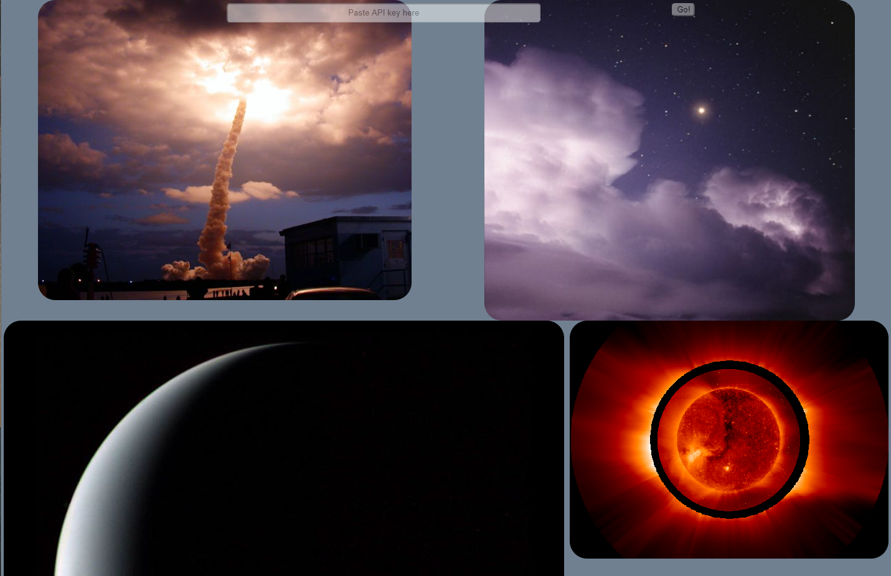

# nasa-playgrounds

  
  

An application to call the NASA [APOD (Astronomy Picture of the Day)](https://github.com/nasa/apod-api) API to and display returned images and videos. To use this application you will need to sign up for a free API key.  
All the details can be found in the [NASA Open APIs documentation](https://api.nasa.gov/api.html#authentication).  

The API used by this application is the [APOD (Astronomy Picture of the Day)](https://github.com/nasa/apod-api).

## Running the application
1. Clone this repository `git clone git@github.com:ReadyPlayer2/nasa-playgrounds.git`.
2. Install dependencies `npm install`.
3. Create a `.env` file in the top level directory and add your API key in the format `API_KEY=abc123`.
4. Start both the Express server and the React application using `npm run dev`. The Express server is available at `localhost:5000` and the React application is available at `localhost:3000`.

## Starting the Express server and React application individually
1. Start the Express server `node server.js` (or simply `nodemon` for dynamic updates). Customise Express server port by using `PORT=1234` in your `.env` file.
2. Start the React application `npm start`.

---

This project was bootstrapped with [Create React App](https://github.com/facebook/create-react-app).
